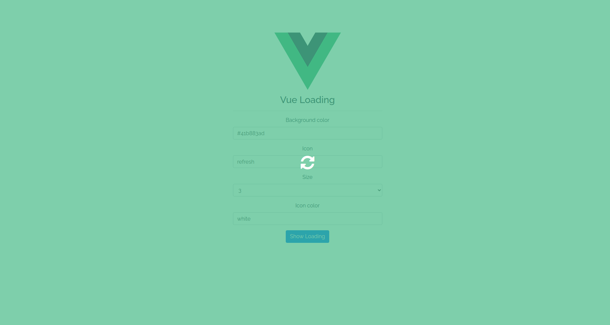

# Vuejs Loading Screen 
Using to block whlie client processed work. Please checkout [Demo](https://helmab.github.io/vue-loading/) to see how does it look like.



## Installation

For vue 2

```
npm i --save vuejs-loading-screen
```

or with vue 3

```
npm i --save vue3-loading-screen
```

## Usage

Vue2:

```js
import Vue from 'vue'
import loading from 'vuejs-loading-screen'

Vue.use(loading)
```

Vue3:

```js
import {createApp} from 'vue'
import App from './App.vue'
import Loading from 'vue3-loading-screen'

const app = createApp(App)

app.use(Loading, /*{...}*/)

app.mount('#app')

```

From now you can use `$isLoading` as globally function to trigger show/hide loading screen.

```vue
<template>
  <h1>Welcome to VueLoading Screen</h1>
</template>

<script>
  export default {
    methods: {
      sendHttpRequest () {
        this.$isLoading(true) // show loading screen
        this.$axios.post(url, params)
        .then(({data}) => {
            console.log(data)
        })
        .finally(() => {
          this.$isLoading(false) // hide loading screen
        })
      }
    },
    mounted () {
      this.sendHttpRequest()
    }
  }
</script>
```

## Customization

If you want to modify such background, icon size, color, type, you just configure options such:

```js
Vue.use(loading, {
    bg: '#41b883ad',
    icon: 'refresh',
    size: 3,
    icon_color: 'white',
})
```

or you can style the loading by yourself (TailwindCss as example):

```js
Vue.use(loading, {
  bg: '#41b883ad',
  slot: `
    <div class="px-5 py-3 bg-gray-800 rounded">
      <h3 class="text-3xl text-white"><i class="fas fa-spinner fa-spin"></i> Loading...</h3>
    </div>
  `
})
```

## Translate your custom text

Start from `main.js` file

```js
import Vue from 'vue'
import VueI18n from 'vue-i18n'
import loading from 'vuejs-loading-screen'

// your i18n setup
Vue.use(VueI18n)

const messages = {
  en: {
    message: {
      loading: 'Loading...'
    }
  },
  km: {
    message: {
      loading: 'កំពុងដំណើរការ...'
    }
  }
}

const i18n = new VueI18n({
  locale: 'en', // set locale
  messages, // set locale messages
})

// config loading plugins
Vue.use(loading, {
  bg: '#41b883ad',
  slot: `
    <div class="px-5 py-3 bg-gray-800 rounded">
      <h3 class="text-3xl text-white"><i class="fas fa-spinner fa-spin"></i> ${ i18n.t('message.loading') }</h3>
    </div>
  `,
})

new Vue({
    i18n,
    ...
}).$mount('#app');

```

And then with `App.vue` file, we need to watch `$i18n.locale` and then call `$changeIsLoadingOptions` function to update plugin options.

```js
watch: {
  '$i18n.locale' () {
    this.$changeIsLoadingOptions({slot: `
      <div class="px-5 py-3 bg-gray-800 rounded">
        <h3 class="text-3xl text-white"><i class="fas fa-spinner fa-spin"></i> ${ this.$t('message.loading') }</h3>
      </div>
    `})
  }
}
```

## Configurations

| Option        | Value           | Description  |
| ------------- | -------------| -----|
| bg      | `default: '#41b883ad'` | : color string |
| icon      | `deault: 'fas fa-spinner'`      |   : support [font-awesome](https://www.npmjs.com/package/@fortawesome/fontawesome-free) |
| size | `default: '3'`      |    : {1, 2, 3, 4, 5} string |
| icon_color | `default: '#ffffff'`      |    : color string |
| slot | `default: font-awesome`      |    : raw html |
